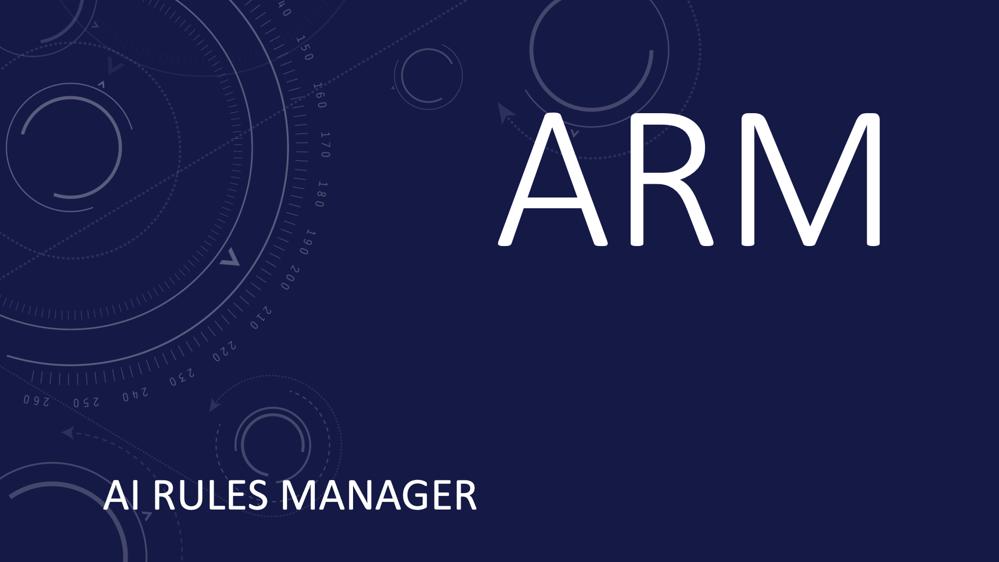

# AI Rules Manager (ARM)

A package manager for AI coding assistant rulesets that enables developers and teams to install, update, and manage coding rules across different AI tools like Cursor and Amazon Q Developer.

## Why ARM?

Stop manually copying `.cursorrules` and `.amazonq/rules` files between projects. ARM provides an npm-like experience for AI coding rules with version control, team synchronization, and multi-registry support.

## Quick Start

```bash
# Install latest version
curl -sSL https://raw.githubusercontent.com/jomadu/ai-rules-manager/main/scripts/install.sh | bash

# Install specific version
curl -sSL https://raw.githubusercontent.com/jomadu/ai-rules-manager/main/scripts/install.sh | bash -s v1.2.3

# Initialize configuration
arm install

# Add a registry
arm config add registry default https://github.com/jomadu/ai-rules-manager-test-git-registry --type=git

# Add channels for your AI tools
arm config add channel cursor --directories .cursor/rules
arm config add channel q --directories .amazonq/rules

# Install your first ruleset
arm install power-up-rules --patterns "rules/*.md"

# Verify installation
arm list

# Check for updates
arm outdated
```

## Features

- **Git Registry Support** - Public/private Git repositories and local Git repositories
- **Semantic Versioning** - Version constraints with `^`, `~`, `>=` operators
- **Content-Based Caching** - Intelligent caching with configurable TTL and size limits
- **Team Synchronization** - Share standardized rules across development teams
- **Cross-Platform** - Fast, reliable Go implementation
- **Channel Management** - Support multiple AI tools simultaneously
- **Reliable Operations** - Direct registry access for always up-to-date data

## Registry Types

| Type | Example | Use Case |
|------|---------|----------|
| **Git** | `github.com/user/repo` | Public/private Git repositories |
| **Git-Local** | `/path/to/local/repo` | Local Git repositories |

## Testing

ARM includes automated testing scripts for comprehensive workflow validation:

```bash
# Create test repository with version history
./tests/integration/git/setup-test-repos.sh

# Run all test scenarios
./tests/integration/git/test-workflow.sh all "https://github.com/USERNAME/ai-rules-manager-test-git-registry"
```

The testing suite validates:
- **Version Resolution** - Latest, semantic versioning, and breaking changes
- **Pattern Matching** - File patterns, exclusions, and complex combinations
- **Registry Integration** - Git-based repository workflows
- **Content Verification** - Ensures correct files are installed with proper content

## Contributing

ARM is designed for community adoption. Contributions welcome for new registry types, AI tool integrations, and feature improvements.

## License

GPL-3.0 License - see [LICENSE.txt](LICENSE.txt) for details.
