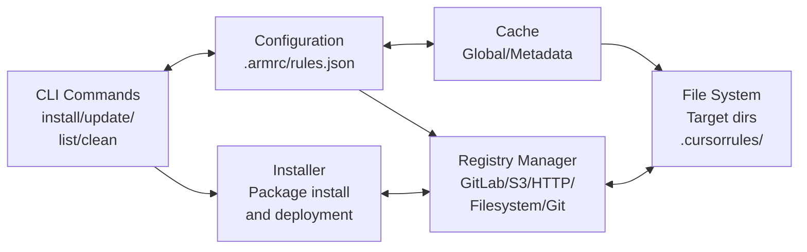

# Architecture Overview

High-level system design and architectural principles of ARM.

## System Design

### Core Principles

- **Registry Agnostic** - Support multiple registry types through common interface
- **Target Flexible** - Deploy to multiple AI tool formats simultaneously
- **Cache Efficient** - Global cache to minimize downloads and improve performance
- **Version Aware** - Semantic versioning with constraint support

### Component Architecture



## Data Flow

### Installation Flow

1. **Command Parsing** - CLI parses user input and options
2. **Configuration Loading** - Load .armrc and rules.json
3. **Registry Resolution** - Determine registry for package
4. **Version Resolution** - Find compatible version
5. **Cache Check** - Check if package already cached
6. **Download** - Fetch package if not cached
7. **Installation** - Deploy to target directories
8. **Lock Update** - Update rules.lock with installed version

### Update Flow

1. **Installed Packages** - Read rules.lock for current state
2. **Version Constraints** - Parse rules.json constraints
3. **Registry Query** - Check for newer versions
4. **Compatibility Check** - Verify version constraints
5. **Backup Creation** - Backup current installation
6. **Update Installation** - Install new version
7. **Rollback on Failure** - Restore backup if needed

## Key Interfaces

### Registry Interface

```go
type Registry interface {
    GetVersions(name string) ([]string, error)
    Download(name, version string) (io.ReadCloser, error)
    GetMetadata(name string) (*Metadata, error)
}
```

### Cache Interface

```go
type Cache interface {
    Get(key string) ([]byte, error)
    Set(key string, data []byte) error
    Delete(key string) error
    Clear() error
}
```

### Installer Interface

```go
type Installer interface {
    Install(name, version string, targets []string) error
    Uninstall(name string, targets []string) error
    IsInstalled(name, version string) bool
}
```

## Security Model

### Authentication
- Environment variable-based token storage
- No credentials in configuration files
- Registry-specific authentication methods

### Package Validation
- Checksum verification for downloaded packages
- Path traversal prevention during extraction
- Safe temporary file handling

### Network Security
- HTTPS enforcement for all registry communications
- Certificate validation
- Configurable timeouts and retry limits

## Performance Characteristics

### Caching Strategy
- **Global Cache** - Shared across all projects
- **Metadata Cache** - Registry version information
- **Package Cache** - Downloaded and extracted packages

### Concurrency
- Parallel registry queries
- Concurrent package downloads
- Thread-safe cache operations

### Resource Usage
- Minimal memory footprint
- Efficient file I/O operations
- Configurable concurrency limits
