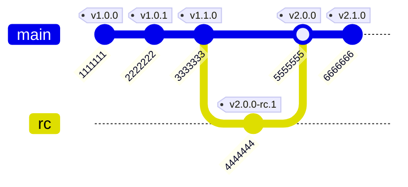

## Commands

## Scenario: Git Registry `https://github.com/my-user/ai-rules`

This scenario demonstrates a typical development lifecycle for a ruleset repository, showing how ARM handles different types of version changes and branch workflows.

### Timeline

#### 1. Initial Release - `v1.0.0` (Tag: `1.0.0`, Commit: `1111111`)
**Branch:** `main`
**Change:** Initial release with grug-brained-dev rules

```
rules/
    cursor/
        grug-brained-dev.mdc     # ← NEW
    amazonq/
        grug-brained-dev.md      # ← NEW
```

#### 2. Patch Release - `v1.0.1` (Tag: `1.0.1`, Commit: `2222222`)
**Branch:** `main`
**Change:** Bug fix in grug-brained-dev.mdc rule

```
rules/
    cursor/
        grug-brained-dev.mdc     # ← MODIFIED (bug fix)
    amazonq/
        grug-brained-dev.md      # (unchanged)
```

#### 3. Minor Release - `v1.1.0` (Tag: `1.1.0`, Commit: `3333333`)
**Branch:** `main`
**Change:** Added task management rules (new features)

```
rules/
    cursor/
        grug-brained-dev.mdc     # (unchanged)
        generate-tasks.mdc       # ← NEW
        process-tasks.mdc        # ← NEW
    amazonq/
        grug-brained-dev.md      # (unchanged)
        generate-tasks.md        # ← NEW
        process-tasks.md         # ← NEW
```

#### 4. Pre-release - `v2.0.0-rc.1` (Tag: `2.0.0-rc.1`, Commit: `4444444`)
**Branch:** `rc`
**Change:** Breaking changes to task rules (testing phase)

```
rules/
    cursor/
        grug-brained-dev.mdc     # (unchanged)
        generate-tasks.mdc       # ← BREAKING CHANGES
        process-tasks.mdc        # ← BREAKING CHANGES
    amazonq/
        grug-brained-dev.md      # (unchanged)
        generate-tasks.md        # ← BREAKING CHANGES
        process-tasks.md         # ← BREAKING CHANGES
```

#### 5. Major Release - `v2.0.0` (Tag: `2.0.0`, Commit: `5555555`)
**Branch:** `main`
**Change:** Breaking changes merged to main (stable release)

```
rules/
    cursor/
        grug-brained-dev.mdc     # (unchanged)
        generate-tasks.mdc       # ← BREAKING CHANGES (stable)
        process-tasks.mdc        # ← BREAKING CHANGES (stable)
    amazonq/
        grug-brained-dev.md      # (unchanged)
        generate-tasks.md        # ← BREAKING CHANGES (stable)
        process-tasks.md         # ← BREAKING CHANGES (stable)
```

#### 6. Minor Release - `v2.1.0` (Tag: `2.1.0`, Commit: `6666666`)
**Branch:** `main`
**Change:** Added clean code rules (new features)

```
rules/
    cursor/
        grug-brained-dev.mdc     # (unchanged)
        generate-tasks.mdc       # (unchanged)
        process-tasks.mdc        # (unchanged)
        clean-code.mdc           # ← NEW
    amazonq/
        grug-brained-dev.md      # (unchanged)
        generate-tasks.md        # (unchanged)
        process-tasks.md         # (unchanged)
        clean-code.md            # ← NEW
```

### Git Workflow Diagram



## Setup

```sh
arm config add registry ai-rules https://github.com/my-user/ai-rules --type git

arm config add sink q --directories .amazonq/rules --rulesets ai-rules/amazonq-rules
arm config add sink cursor --directories .cursor/rules --rulesets ai-rules/cursor-rules
```

`.armrc.json`

```json
{
    "registries": {
        "ai-rules": {
            "url": "https://github.com/my-user/ai-rules",
            "type": "git"
        }
    },
    "channels": {
        "q": {
            "directories": [
                ".amazonq/rules"
            ],
            "rulesets": [
                "ai-rules/amazonq-rules"
            ]
        },
        "cursor": {
            "directories": [
                ".cursor/rules"
            ],
            "rulesets": [
                "ai-rules/cursor-rules"
            ]
        }
    }
}
```

## Install

### Specifying No Version

When a user installs without specifying a version, ARM finds the latest semver tag, and constrains the version within the latest major.

```sh
arm install ai-rules/amazonq-rules --patterns rules/amazonq/*.md
arm install ai-rules/cursor-rules --patterns rules/cursor/*.mdc
```

`arm.json`

```json
{
    "rulesets": {
        "ai-rules": {
            "amazonq-rules": {
                "version": "^2.1.0",
                "patterns": ["rules/amazonq/*.md"]
            },
            "cursor-rules": {
                "version": "^2.1.0",
                "patterns": ["rules/cursor/*.mdc"]
            },
        }
    }
}
```

`arm.lock`

```json
{
    "rulesets": {
        "ai-rules": {
            "amazonq-rules": {
                "url": "https://github.com/my-user/ai-rules",
                "type": "git",
                "constraint": "^2.1.0",
                "resolved": "2.1.0",
                "patterns": ["rules/amazonq/*.md"]
            },
            "cursor-rules": {
                "url": "https://github.com/my-user/ai-rules",
                "type": "git",
                "constraint": "^2.1.0",
                "resolved": "2.1.0",
                "patterns": ["rules/cursor/*.mdc"]
            },
        }
    }
}
```

`./`
```
.armrc.json
arm.json
arm.lock
.cursor/
    rules/
        arm/
            ai-rules/
                cursor-rules/
                    2.1.0/
                        rules/
                            cursor/
                                grug-brained-dev.mdc
                                generate-tasks.mdc
                                process-tasks.mdc
.amazonq/
    rules/
        arm/
            ai-rules/
                amazonq-rules/
                    2.1.0/
                        rules/
                            amazonq/
                                grug-brained-dev.md
                                generate-tasks.md
                                process-tasks.md
```

`~/.arm/cache`

```
registries/
    sha256("https://github.com/my-user/ai-rules" + "git")/ <- registry cache key is hashed normalized url + normalized type
        index.json
        repository/
            ai-rules/
                .git/
                ...
        rulesets/
            sha256("rules/amazonq/*.mdc") <- ruleset cache key is hashed normalized patterns
                6666666/
                    rules/
                        amazonq/
                            grug-brained-dev.md
                            generate-tasks.md
                            process-tasks.md
            sha256("rules/cursor/*.mdc")
                6666666/
                    rules/
                        cursor/
                            grug-brained-dev.md
                            generate-tasks.md
                            process-tasks.md
```

`~/.arm/cache/registries/sha256("https://github.com/my-user/ai-rules" + "git")/index.json`

```json
{
  "created_on": "2024-01-15T10:30:00Z",
  "last_updated_on": "2024-01-15T10:30:00Z",
  "last_accessed_on": "2024-01-15T10:30:00Z",
  "normalized_registry_url": "https://github.com/user/repo",
  "normalized_registry_type": "git",
  "rulesets": {
    "xyz789abc123...": {
      "normalized_ruleset_patterns": ["rules/cursor/*.mdc"],
      "created_on": "2024-01-15T10:30:00Z",
      "last_updated_on": "2024-01-15T10:30:00Z",
      "last_accessed_on": "2024-01-15T10:30:00Z",
      "versions": {
        "6666666": {
          "created_on": "2024-01-15T10:30:00Z",
          "last_updated_on": "2024-01-15T10:30:00Z",
          "last_accessed_on": "2024-01-15T10:30:00Z"
        }
      }
    },
    "aadbbf3222b3...": {
      "normalized_ruleset_patterns": ["rules/amazonq/*.mdc"],
      "created_on": "2024-01-15T10:30:00Z",
      "last_updated_on": "2024-01-15T10:30:00Z",
      "last_accessed_on": "2024-01-15T10:30:00Z",
      "versions": {
        "6666666": {
          "created_on": "2024-01-15T10:30:00Z",
          "last_updated_on": "2024-01-15T10:30:00Z",
          "last_accessed_on": "2024-01-15T10:30:00Z"
        }
      }
    }
  }
}
```

### Specifying Full Version

specifying the full version string will pin (e.g., `=1.0.0`)

```sh
arm install ai-rules/amazonq-rules@1.0.0 --patterns rules/amazonq/*.md
arm install ai-rules/cursor-rules@1.0.0 --patterns rules/cursor/*.mdc
```

### Specifying Major and Minor Version

specifying the major and minor will pin within minor (e.g., `~1.0.0`)

```sh
arm install ai-rules/amazonq-rules@1.0 --patterns rules/amazonq/*.md
arm install ai-rules/cursor-rules@1.0 --patterns rules/cursor/*.mdc
```

### Specifying Major

specifying the major will allow within major (e.g., `^1.0.0`)

```sh
arm install ai-rules/amazonq-rules@1 --patterns rules/amazonq/*.md
arm install ai-rules/cursor-rules@1 --patterns rules/cursor/*.mdc
```

### Specifying Branch

specifying a branch name will track the head of the branch

```sh
arm install ai-rules/amazonq-rules@main --patterns rules/amazonq/*.md
arm install ai-rules/cursor-rules@main --patterns rules/cursor/*.mdc
```
